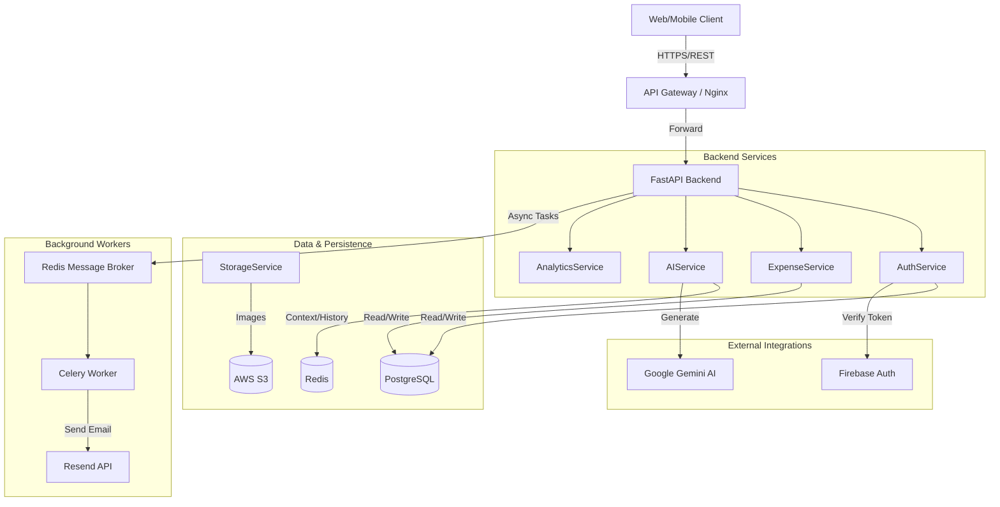

# HisabKitab System Architecture

## 1. System Overview

HisabKitab is a modern, AI-powered personal finance management system. It leverages a microservices-ready modular monolith architecture on the backend and a responsive Next.js application on the frontend. The system is designed for high performance, scalability, and enhanced user experience through AI interactions.

### High-Level Architecture Diagram

## 2. Backend Architecture
**Framework**: FastAPI (Python)
**Pattern**: Layered Architecture (Router -> Service -> CRUD -> Model)

### Key Components:
-   **API Layer (`app/api`)**: Handles HTTP requests, validation (Pydantic), and dependency injection.
-   **Service Layer (`app/services`)**: Contains business logic (e.g., `AIService`, `AuthService`). This layer orchestrates data operations and external API calls.
-   **Core (`app/core`)**: Configuration, security, and global utilities.
-   **Background Tasks**: Uses **Celery** with **Redis** broker for offloading time-consuming operations like sending emails (`app/tasks.py`).
-   **AI Engine**: Integrates **Google Gemini** for generative insights. Features "Contextual Memory" by storing conversation history in Redis.

## 3. Frontend Architecture
**Framework**: Next.js 14 (React)
**Styling**: Tailwind CSS + Shadcn UI

### Key Features:
-   **Authentication**: Managed via Firebase Client SDK (frontend) verifying tokens with Backend.
-   **State Management**: React Context (`NotificationContext`) and local state.
-   **Visualizations**: Recharts for financial graphs.
-   **Error Handling**: Global Error Boundary and Sentry integration for monitoring.

## 4. Database Schema (Simplified)
-   **Users**: Stores profile info (synced from Firebase).
-   **Expenses**: Core transactional data, linked to Users and Categories.
-   **Categories**: User-defined or default categories.
-   **Budgets**: Monthly limits per category.

## 5. Security & Deployment
-   **Authentication**: JWT (for session management) exchanging Firebase ID Tokens.
-   **Monitoring**: Prometheus metrics exposed at `/metrics`. Sentry for error tracking.
-   **Containerization**: Docker-ready (implied possibility for future).
